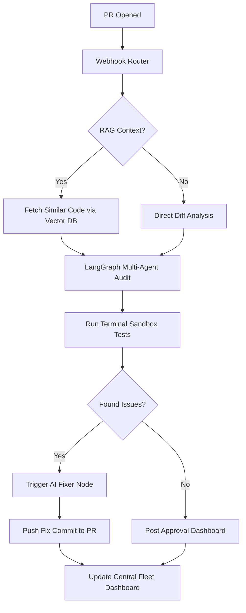

# Future Scope: Autonomous AI Engineering Suite 🚀

This document outlines the strategic roadmap and architectural blueprints for evolving the current AI Code Reviewer into a world-class, enterprise-grade Autonomous Engineering platform.

---

## 🏗️ Phase 1: AI Autopilot & Self-Healing Code
**Goal**: Move from "Reporting Issues" to "Issuing Fixes."

### Workflow
1. **Detection**: Auditor identifies a bug (e.g., SQLi).
2. **Synthesis**: A new `CorrectionNode` is triggered in LangGraph. 
3. **Drafting**: The AI uses the `git` library to create a new branch: `ai-fix/[original-branch]`.
4. **Validation**: The AI runs the existing **Terminal Sandbox** tests against its *own* fix to verify the 🔴 goes 🟢.
5. **Pull Request**: The AI opens a **Stacked PR** or pushes a commit directly to the user's branch with the fix.

### Implementation Plan
- Integrate `nodegit` or `@octokit/rest` for branch management.
- Add a `fixerNode` to `src/orchestrator/graph.ts`.
- Implement a "Human-in-the-loop" approval button in the GitHub comment (using GitHub Actions interaction).

---

## 🔍 Phase 2: Repository-Wide Context (RAG & Vector Indexing)
**Goal**: Understand the *intent* and *architecture* of the entire project, not just the diff.

### Technical Stack
- **Vector DB**: Pinecone or ChromaDB.
- **Embedding Model**: OpenAI `text-embedding-3-small` or Gemini `text-embedding-004`.
- **Indexing**: A background worker that re-indexes the repository on every `push`.

### Implementation Plan
- Create a `src/indexing/` service to walk the file tree and store chunks in a vector database.
- Update the `Integration Auditor` to perform semantic searches for related functions before giving feedback.

---

## 📊 Phase 3: The Fleet Management Dashboard
**Goal**: A central "Nerve Center" for engineering managers and CTOs.

### Features
- **Project Health Score**: A 0-100 score based on AI findings over time.
- **Leaderboard**: See which projects/modules have the most "AI-caught" vulnerabilities.
- **Live Logs**: Real-time stream of the LangGraph state machine as it traverses a PR.

### Implementation Plan
- **Backend**: Update the Express server to pipe logs to a WebSocket.
- **Frontend**: Vite + React + Tailwind + Tremor (for charts).
- **Persistence**: MongoDB or PostgreSQL to store historical PR analysis data.

---

## ☁️ Phase 4: Production-Grade Deployment
**Goal**: 99.9% availability and multi-repo support.

### Workflow
1. **Containerization**: Wrap the orchestrator in a Docker volume.
2. **Serverless Execution**: Move LangGraph nodes to AWS Lambda or Google Cloud Functions to handle massive traffic bursts.
3. **GitHub App**: Convert the current Webhook PAT system into a formal **GitHub Marketplace App** for easy installation.

---

## 🤖 Phase 5: Team Memory & Adaptive Learning
**Goal**: The AI learns from human feedback to stop giving "annoying" or repeated advice.

### Implementation Plan
- **Feedback Loop**: If a user clicks "Dismiss" or "Ignore" on an AI comment, store that feedback in the Vector DB.
- **Dynamic Prompting**: Inject "Team Preferences" (e.g. *"This team prefers arrow functions over declarations"*) into the System Prompts based on historical human reviews.

---

### **Visualizing the Future Workflow**

_This future scope transforms the tool from an auditor into a true Autonomous Teammate._
